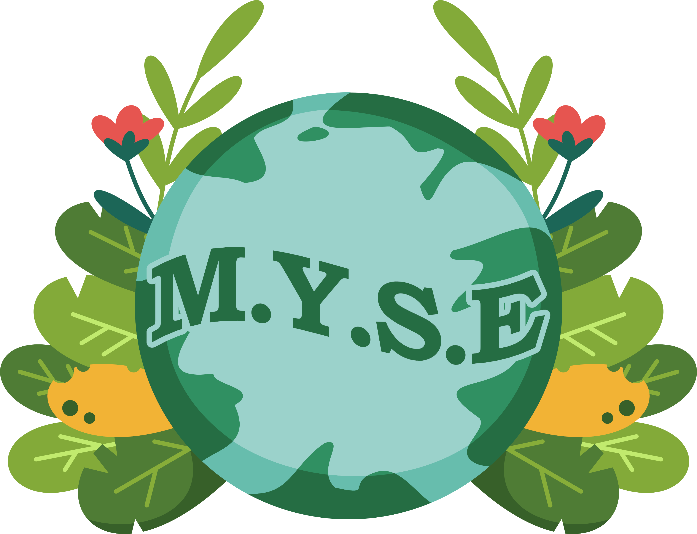

    

    
    
    
  

## 📝Table of contents
- [Description](#description)
- [Built Using](#built_using)
- [Authors](#authors)
- [Presentation and Documentation](#documentation)
- [How to set up Project](#set_up)   
- [Interface](interface)

## 📖 Description 
This is a C++ project, made for a school project. It's main goal is to teach people how a small ecosystem works and how the different types of animals are connected with one another.

## 💻 Build Using 
- [Visual Studio](https://visualstudio.microsoft.com/) - Application
- [TGUI](https://tgui.eu/) - Framework
- [Word](https://www.microsoft.com/en-us/microsoft-365/word) - Documentation
- [PowerPoint](https://www.microsoft.com/en-us/microsoft-365/powerpoint) - Presentation
- [Excel](https://www.microsoft.com/en-us/microsoft-365/excel) - QA Documentation

## 👥 Authors 
- [Stas Uzunov](https://github.com/SSUzunov19) - Scrum Trainer 
- [Daniel Georgiev](https://github.com/DZGeorgiev19) - Front-End Developer
- [Vasil Mladenov](https://github.com/VLMladenov19) - Back-End Developer
- [Viktor Kirov](https://github.com/VRKirov19) - QA Engineer

## 📋 Presentation and Documentation 
+ <a href = "https://codingburgas-my.sharepoint.com/:w:/g/personal/vlmladenov19_codingburgas_bg/EQ9pBv58_KZFlYmRgcnzeG8BoKyq7DFhj6IqH-V_cNrCQA?e=1L9PHO">Documentation</a>
+ <a href = "https://codingburgas-my.sharepoint.com/:p:/g/personal/vlmladenov19_codingburgas_bg/EWDQwVTjrwZPst6mDR1JLxIBPNWBcML3ReJ1F2XE0PsZ2g?e=l1jPOq">Presentation</a>
+ <a href = "https://codingburgas-my.sharepoint.com/:x:/g/personal/vlmladenov19_codingburgas_bg/EVW6aeq0eqtOqdmL3zHF0u4BE_aZrdrRtKRhO8NDQ95YIg?e=ZxVUZf">QA Documentation</a>

## ⚙️ How to set up Project 
- Download the program from the green button or clone it by using this command:
<pre>git clone https://github.com/codingburgas/2122-10-biology-M.Y.S.E.git</pre>
- Follow this link, to install SMFL - <a href="https://github.com/SFML/SFML">Here</a> 
- Follow this link, to install TGUI Nightly build - <a href="https://github.com/texus/TGUI">Here</a>
- Download SFML and TGUI in the directory where you have downloaded your program
- Rename **TGUI-0.10-nightly** to **TGUI-0.10**

- Open the project, to the **project-biology** folder and open the solution file
- Right click **project-biology** 
- Go to **Properties->Configuration Properties->Debugging->Environment** and type:
<pre>PATH=$(SolutionDir)..\..\\TGUI-0.10\\\bin;$(SolutionDir)..\..\SFML-2.5.1\bin</pre>

- Change the solution platform to **x86**
- Now you can run the project

## 🖼️ Interface of Project 
- Тhis is the main menu where you choose what to do:
     * Play - Open the simulation
     * About Us - Information about the creators of the project
     * Help - Shows information about the simulation and how to operate it                   
     * Quit - Еxit the program

    

                                      
    
     
    <h1>  Simulation Tab  </h1>
      
    
     
    <h1> About Us Tab </h1>
     
    
     
    <h1> Help Tab </h1>
     
    
     
    
